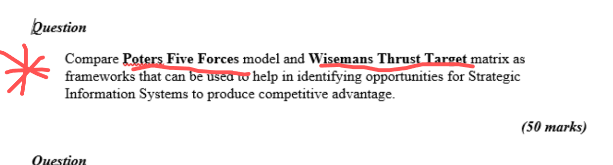

# Enterprise-Governance-Compliance

Here's a comprehensive comparison between **Porter’s Five Forces** and **Wiseman’s Strategic Thrusts and Target Matrix**, specifically in the context of **Strategic Information Systems** and **gaining competitive advantage**:

---

### 🔍 **Overview of the Two Frameworks**

| Feature              | **Porter’s Five Forces**                 | **Wiseman’s Strategic Thrusts and Target Matrix**   |
| -------------------- | ---------------------------------------- | --------------------------------------------------- |
| **Purpose**          | Analyse industry structure & competition | Identify how IT can be used for strategic advantage |
| **Focus**            | External competitive forces              | Internal IT-enabled strategies                      |
| **Developed by**     | Michael E. Porter                        | Charles C. Wiseman                                  |
| **Application Area** | Business strategy formulation            | Strategic use of Information Systems                |

---

### 🧱 **Framework Structure**

#### **Porter’s Five Forces:**

1. **Threat of New Entrants**
2. **Bargaining Power of Suppliers**
3. **Bargaining Power of Buyers**
4. **Threat of Substitute Products or Services**
5. **Rivalry Among Existing Competitors**

> 🔹 *Use:* Understand industry competitiveness and profitability. IT can reduce threats or power (e.g., CRM to reduce buyer power).

#### **Wiseman’s Strategic Thrusts:**

1. **Differentiate** – Use IT to make offerings unique (e.g., customisation via a website).
2. **Cost Leadership** – Use IT to reduce operating costs.
3. **Innovation** – Use IT to launch new products/services.
4. **Growth** – Use IT to enter new markets or segments.
5. **Alliance** – Use IT to build strategic partnerships.

> 🔹 *Use:* Directly guide IS development to support business goals.

---

### ⚔️ **Comparison in Use for Strategic Information Systems**

| Dimension         | **Porter’s Five Forces**                  | **Wiseman’s Strategic Thrusts**                |
| ----------------- | ----------------------------------------- | ---------------------------------------------- |
| **Scope**         | Industry-wide                             | Organisation-specific                          |
| **Strategy Type** | Defensive (respond to external threats)   | Offensive (exploit IT for advantage)           |
| **IS Role**       | Support existing competitive strategy     | Drive new strategy through IT                  |
| **Example**       | Use of databases to reduce supplier power | Use of mobile app to create new customer value |

---

### 💡 **Examples in Action**

* A **real estate company** might use:

  * **Porter’s Model**: To analyse competition (e.g., online platforms like Daft.ie increase buyer power).
  * **Wiseman’s Thrusts**: To build a custom CRM system (Differentiation) and expand via online bookings (Growth).

---

### 🏁 **Conclusion**

While **Porter’s Five Forces** helps identify *where* IT can reduce competitive pressures, **Wiseman’s model** guides *how* IT can be strategically applied to drive business value. For a Strategic Information System to be effective, both models should ideally be used together: first, understand the threats, then apply IS to counter or capitalise on them.

---