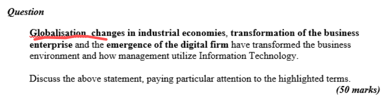

Certainly, Tom. Here's a structured answer to the question based on the highlighted terms:

---

## 📌 **Discussing the Impact of IT on Management in Light of Globalisation, Industrial Changes, Business Transformation, and the Digital Firm**

### 1. 🌍 **Globalisation**

Globalisation has led to the integration of markets, supply chains, and communication across international borders. This increased connectivity requires management to adopt IT systems that support:

* **24/7 operations** across time zones
* **Real-time communication** via tools like Zoom or Microsoft Teams
* **Global supply chain management** through ERP systems like SAP
  Managers must think globally but act locally, using data analytics and decision-support systems to tailor services while staying efficient at scale.

---

### 2. ⚙️ **Changes in Industrial Economies**

Shifts from manufacturing to **knowledge-based economies** have made **information and services** more valuable than physical goods. This evolution means:

* **Information is a strategic asset** — requiring proper IT governance
* **Automation and AI** have replaced repetitive tasks, changing workforce needs
* Management must now focus on **digital skillsets**, **data security**, and **innovation strategy**.

---

### 3. 🏢 **Transformation of the Business Enterprise**

Modern enterprises are no longer rigid hierarchies. IT has enabled:

* **Decentralised decision-making** through real-time dashboards
* **Flattened structures**, with teams using collaborative tools like Slack and SharePoint
* **Virtual organisations** operating without fixed offices
  Managers must adapt by learning to lead **remote teams**, manage **digital workflows**, and align IT with business goals.

---

### 4. 💻 **Emergence of the Digital Firm**

A digital firm uses IT in every aspect of its operations and strategy. Key characteristics include:

* **Business processes fully digitised** (e.g., Amazon automating order fulfilment)
* **Digital products and services** (e.g., Netflix, Airbnb)
* **IT as a core enabler** of business agility and customer experience

Management roles are redefined:

* Focus shifts to **digital transformation leadership**
* Greater emphasis on **cybersecurity**, **cloud infrastructure**, and **data-driven decision-making**

---

### 🎯 **Conclusion**

The digital era, driven by globalisation and industrial transformation, has revolutionised how management approaches operations, strategy, and customer engagement. Effective management today means leveraging IT not as a support function, but as a **central strategic tool** that empowers innovation, responsiveness, and competitive advantage.

---
